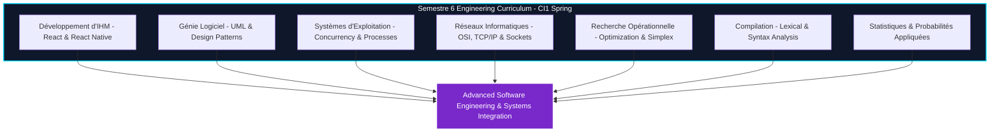

<div align="center">

<!-- Header Banner -->


<!-- Typing Animation -->
<p align="center">
  
</p>

<!-- Quality & Community Badges -->
<p align="center">
  <a href="LICENSE"></a>
  <a href="https://github.com/Bosaj/interactive-systems-software-engineering/actions"></a>
  <a href="https://github.com/Bosaj/interactive-systems-software-engineering/stargazers"></a>
  <a href="https://github.com/users/Bosaj/projects/36"></a>
  <a href="https://github.com/stars/Bosaj/lists/eniad-academic-projects"></a>
  
</p>

</div>

<!-- Divider -->


## 📖 Overview

**ENIAD Software Engineering & Interactive Systems (Semestre 6)** is an official engineering laboratory suite developed within the **State Engineering Degree in Artificial Intelligence & Digital Systems** at the **École Nationale d'Intelligence Artificielle et du Digital (ENIAD)**, Mohammed First University, Berkane, Morocco.

Engineering Suite for Semestre 6: React & React Native IHM, Software Engineering (UML/Design Patterns), Operating Systems Concurrency, Computer Networks (OSI/TCP-IP), Operational Research & Compiler Design.

---

## 🏗️ Technical Architecture



---

## 📂 Curriculum & Laboratory Breakdown

| Module / Lab Directory | Technology Stack | Key Concepts & Deliverables |
|---|---|---|
| `Développement d'IHM` | React, React Native, Expo, TypeScript | Component lifecycle, state management, REST API integration, navigation routing, mobile views |
| `Génie Logiciel` | UML 2.5, Case Tools | Use cases, class diagrams, sequence diagrams, state machines, architectural patterns |
| `Système d'exploitation` | C / Shell / Concurrency | Multithreading, mutual exclusion, semaphores, process scheduling, memory virtualization |
| `Réseaux Informatique` | TCP/IP, Wireshark, Cisco | Network layer addressing, subnetting (CIDR), transport layer protocols, routing algorithms |
| `Recherche Operationenelle` | Linear Programming, Graph Theory | Simplex algorithm, duality, transport problems, PERT/CPM scheduling, maximum flow |
| `Compilation` | Formal Grammars, Automata | Regular expressions, lexer/parser design, LL(k)/LR(k) parsing tables, abstract syntax trees |
| `Statistiques` | Probability Theory, Estimation | Random variables, continuous/discrete distributions, confidence intervals, hypothesis testing |


---

## 📚 Technical Wiki & Documentation

Comprehensive architectural explanations, step-by-step lab walk-throughs, and methodology guides are available:
- **In-Repository Wiki Mirror**: [`docs/wiki/Home.md`](docs/wiki/Home.md)
- **Architecture Overview**: [`docs/ARCHITECTURE.md`](docs/ARCHITECTURE.md)
- **Curriculum Matrix**: [`docs/CURRICULUM_MATRIX.md`](docs/CURRICULUM_MATRIX.md)
- **GitHub Wiki**: [https://github.com/Bosaj/interactive-systems-software-engineering/wiki](https://github.com/Bosaj/interactive-systems-software-engineering/wiki)

---

## 🚀 Getting Started

### Prerequisites
- Node.js (v18+) and npm
- Python 3.10+
- GCC / C++ Compiler
- Expo CLI (`npm install -g expo-cli`)

### Installation & Cloning
```bash
git clone https://github.com/Bosaj/interactive-systems-software-engineering.git
cd interactive-systems-software-engineering
```

---

## 📜 DevSecOps Governance & Standards

This repository adheres to strict open-source engineering and academic integrity standards:
- [LICENSE](LICENSE): Open-source MIT License.
- [CONTRIBUTING.md](CONTRIBUTING.md): Guidelines for submitting contributions, issue templates, and code formatting.
- [CODE_OF_CONDUCT.md](CODE_OF_CONDUCT.md): Contributor Covenant v2.1 code of conduct.
- [SECURITY.md](SECURITY.md): Responsible vulnerability reporting procedures.
- [CHANGELOG.md](CHANGELOG.md): Version history following Keep a Changelog standards.
- [CITATION.cff](CITATION.cff): Machine-readable academic citation metadata.

---

## 👤 Author & Academic Credits

- **Engineer / Researcher**: **Oussama EL HADJI** ([@Bosaj](https://github.com/Bosaj))
- **Role**: AI & Automation Engineer @ Circet Morocco | ENIAD Engineering Graduate
- **Institution**: École Nationale d'Intelligence Artificielle et du Digital (ENIAD), Berkane, Morocco
- **Portfolio**: [bosaj.vercel.app](https://bosaj.vercel.app) • [LinkedIn](https://www.linkedin.com/in/oussama-elhadji)

---

<div align="center">
  <sub>Maintained with ❤️ by <a href="https://github.com/Bosaj">Oussama EL HADJI</a> • ENIAD Berkane</sub>
</div>
