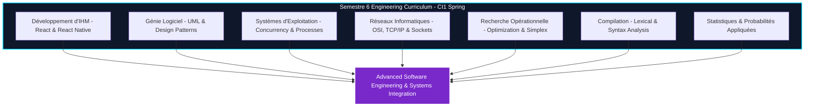

# Architecture Overview — ENIAD Software Engineering & Interactive Systems (Semestre 6)

```mermaid
graph TD
    subgraph S6_Curriculum [Semestre 6 Engineering Curriculum - CI1 Spring]
        IHM[Développement d'IHM - React & React Native]
        GL[Génie Logiciel - UML & Design Patterns]
        SE[Systèmes d'Exploitation - Concurrency & Processes]
        NET[Réseaux Informatiques - OSI, TCP/IP & Sockets]
        RO[Recherche Opérationnelle - Optimization & Simplex]
        COMP[Compilation - Lexical & Syntax Analysis]
        STAT[Statistiques & Probabilités Appliquées]
    end
    IHM --> SENG[Advanced Software Engineering & Systems Integration]
    GL --> SENG
    SE --> SENG
    NET --> SENG
    RO --> SENG
    COMP --> SENG
    STAT --> SENG
    style S6_Curriculum fill:#0F172A,stroke:#00D9FF,stroke-width:2px,color:#fff
    style SENG fill:#7928CA,stroke:#fff,stroke-width:2px,color:#fff

```
