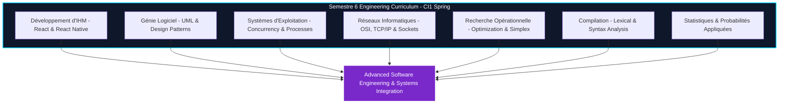

# Welcome to the ENIAD Software Engineering & Interactive Systems (Semestre 6) Wiki 📖

Welcome to the official technical documentation and laboratory guide for **ENIAD Software Engineering & Interactive Systems (Semestre 6)**.

---

## 🎯 Course Overview

Engineering Suite for Semestre 6: React & React Native IHM, Software Engineering (UML/Design Patterns), Operating Systems Concurrency, Computer Networks (OSI/TCP-IP), Operational Research & Compiler Design.

Developed within the **State Engineering Degree in Artificial Intelligence & Digital Systems** at the **École Nationale d'Intelligence Artificielle et du Digital (ENIAD)**, Mohammed First University, Berkane, Morocco.

---

## 📚 Wiki Documentation Chapters

| Chapter | Description | Primary Topics |
| :--- | :--- | :--- |
| **[[Architecture]]** | Deep architectural design & component topology | Systems architecture, concurrency models, client-server models |
| **[[Getting-Started]]** | Developer setup & workstation configuration | Node.js, React Native/Expo setup, C/C++ compilation toolchains |
| **[[Curriculum-Guide]]** | Detailed syllabus and laboratory breakdown | Lab objectives, exercise solutions, deliverables |

---

## 🏛️ System Architecture Snapshot

---

*Maintained with ❤️ by [Oussama EL HADJI](https://github.com/Bosaj) • ENIAD Berkane*
